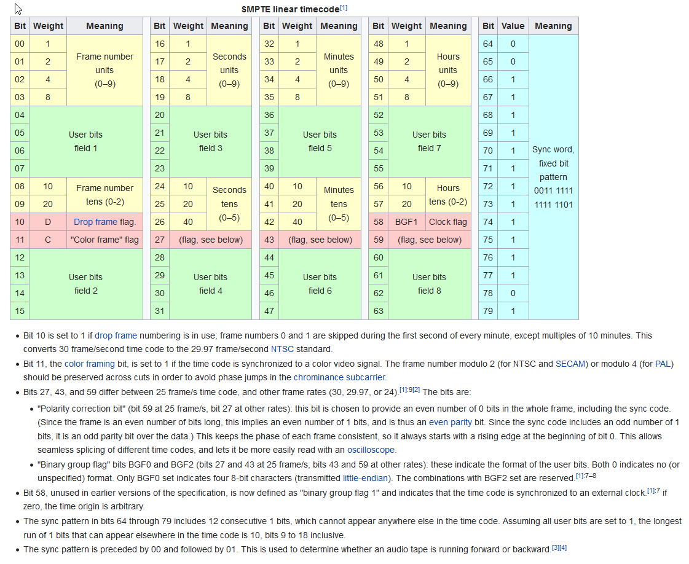

# LinearTimecode-Decoder
LTC decoder for Teensy Audio Library

see: https://forum.pjrc.com/threads/41584-Audio-Library-for-Linear-Timecode-(LTC)

Linear (or Longitudinal) Timecode (LTC) is an encoding of SMPTE timecode data in an audio signal, as defined in SMPTE 12M specification. The audio signal is commonly recorded on a VTR track or other storage media. The bits are encoded using the biphase mark code (also known as FM): a 0 bit has a single transition at the start of the bit period. A 1 bit has two transitions, at the beginning and middle of the period. This encoding is self-clocking. Each frame is terminated by a 'sync word' which has a special predefined sync relationship with any video or film content.

A special bit in the linear timecode frame, the biphase mark correction bit, ensures that there are an even number of AC transitions in each timecode frame.

The sound of linear timecode is a jarring and distinctive noise and has been used as a sound-effects shorthand to imply telemetry or computers. 

from: https://en.wikipedia.org/wiki/Linear_timecode
